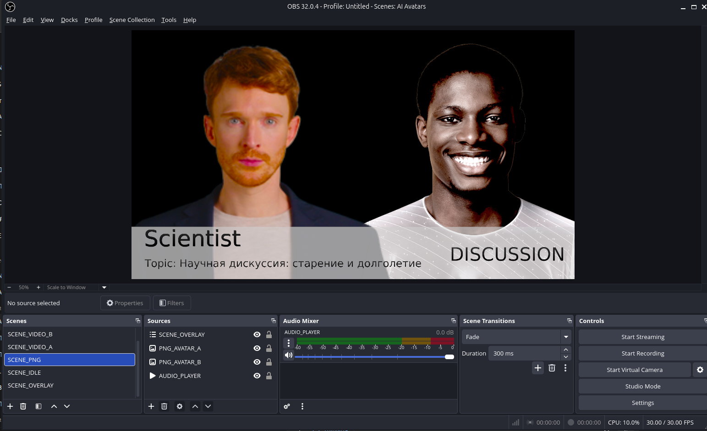
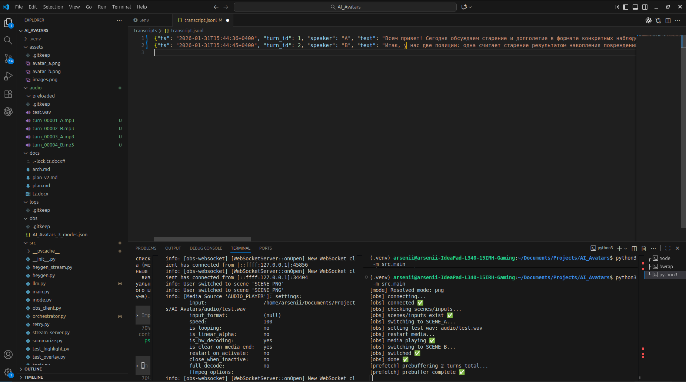

# AI Avatars Stream — MVP

## Демо / Артефакты
Запись на YouTube (VOD): [https://www.youtube.com/watch?v=4UQxmndK8uw](https://www.youtube.com/watch?v=4UQxmndK8uw)  
Транскрипт (jsonl): [transcripts/transcript.jsonl](transcripts/transcript.jsonl)  
Транскрипт содержит ts/speaker/llm_latency/tts_latency и соответствует VOD.  
Как запустить (PNG‑режим): `python -m src.main`  
Что увидите: два PNG‑аватара, подсветка SPEAK/DIM, голос, автономный диалог

Проект: **MVP** — PNG‑аватары + LLM→TTS в реальном времени + OBS управление сценами + YouTube Live; HeyGen/YouTube чат — опционально.

## Скриншоты
Кадр из видео/OBS (две PNG + активный спикер, DIM/SPEAK):  

Кадр с логом/транскриптом (llm_latency/tts_latency):  

## Соответствие ТЗ
✅ 2 агента, PNG‑аватары  
✅ LLM→TTS в реальном времени  
✅ автономно (без ручного управления)  
✅ OBS → YouTube Live  
✅ контекст: history + running summary  
✅ транскрипт: jsonl  
✅ (опционально) lip‑sync: HeyGen modes

## Содержимое репозитория
- `.env.example` — конфигурация запуска.
- `obs/AI_Avatars_3_modes.json` — OBS preset (сцены/источники).
- `src/orchestrator.py` — основная логика.
- `src/obs_client.py` — OBS WebSocket клиент.
- `src/llm.py`, `src/tts.py` — LLM/TTS.
- `transcripts/transcript.jsonl` — пример транскрипта.

## Дефолты MVP (зафиксировано)
- В mp3‑режиме OBS проигрывает аудио через **Media Source** (`AUDIO_PLAYER`).
- В streaming‑режиме OBS использует **Browser Source** (WebRTC LiveKit).
- `queue_floor=2`.
- Тема читается из `TOPIC`/`topic.txt`, период обновления — `TOPIC_RELOAD_S`.
- Контекст: последние 10–12 реплик + краткий summary.
- Длина реплики: по умолчанию 1–2 предложения (`MAX_SENTENCES=2`).
- Длина эфира: 25 ходов с финальными раундами и закрытием (`MAX_TURNS=25`).

## OBS‑пресет (AI_Avatars_3_modes.json)
В проекте есть конфигурация OBS `obs/AI_Avatars_3_modes.json` со сценами/источниками:
- Сцены: `SCENE_PNG`, `SCENE_STREAM`, `SCENE_VIDEO_A`, `SCENE_VIDEO_B`, `SCENE_IDLE`, `SCENE_OVERLAY`
- Источники: `PNG_AVATAR_A/B`, `STREAM_AVATAR_A/B`, `MEDIA_A_MP4`, `MEDIA_B_MP4`, `AUDIO_PLAYER`, `TXT_*`

Импорт в OBS: Коллекции сцен → Импорт → `obs/AI_Avatars_3_modes.json`.

Переключение режимов — только через `.env` (OBS не трогаем).  
Режим выбирается одной переменной `AVATAR_MODE` (она имеет приоритет над legacy‑флагами).
Можно включить `OBS_STRICT=1`, чтобы падать сразу при несовпадении имен источников/фильтров.

## Быстрый старт: режим 1 (PNG + TTS, рекомендован)
1) Скопируй `.env.example` → `.env`
2) Убедись, что `AVATAR_MODE=png` и источники соответствуют OBS‑конфигу
3) Запуск: `python -m src.main`

Нужен `OPENAI_API_KEY`; для OBS — `OBS_PASSWORD/OBS_PORT` (если включена авторизация).

Чекпоинты успеха:
- OBS подключился (в логе есть `connected ✅`)
- Реплики генерятся live (видно `llm_latency/tts_latency`)
- В OBS подсветка переключается (`DIM/SPEAK`)

Транскрипт пишется в `TRANSCRIPT_PATH`.

## Выбор режима (через .env)
Рекомендуемый для записи: `AVATAR_MODE=png` (PNG + TTS).  
Опционально (платные лимиты): `AVATAR_MODE=heygen_stream` / `AVATAR_MODE=heygen_video`.  
YouTube чат: включается отдельно через `YOUTUBE_CHAT_ENABLE=1`.

Примечание: в текущем OBS конфиге нет `SCENE_VIDEO_IDLE`, поэтому idle‑сцена — `SCENE_IDLE`.

## Стрим на YouTube
1) Настрой трансляцию в OBS: выбери сервис YouTube и укажи Stream Key (или RTMPS URL).
2) Запусти проект как обычно (`python -m src.main`).
3) Опционально: `OBS_AUTO_START_STREAM=1` — автостарт стрима после prebuffer (если он включён).
4) Опционально (для опытных): настроить стрим из `.env` — иначе лучше вручную в OBS.
   Если всё же хочешь:
   - `OBS_STREAM_SERVICE_TYPE=rtmp_common`
   - `OBS_STREAM_SERVICE=YouTube - RTMPS` (или другое имя сервиса из OBS)
   - `OBS_STREAM_KEY=...`
   - Опционально `OBS_STREAM_SERVER=...`
   - И включи `OBS_STREAM_APPLY=1`

## Смена темы через YouTube чат
1) `YOUTUBE_CHAT_ENABLE=1`
2) Укажи `YOUTUBE_BROADCAST_ID` или `YOUTUBE_LIVE_CHAT_ID`
3) Авторизация: либо `YOUTUBE_API_KEY`, либо OAuth (`YOUTUBE_CLIENT_ID`, `YOUTUBE_CLIENT_SECRET`, `YOUTUBE_REFRESH_TOKEN`)
4) Команда в чате: `!topic новая тема` (префикс настраивается через `YOUTUBE_TOPIC_PREFIX`)

## Частые вопросы
- Чёрный экран: проверь корректность `VIDEO_PLAYER_A/B` или `AUDIO_PLAYER`, увеличь `MEDIA_START_TIMEOUT_S`, `MEDIA_START_RETRIES`, добавь `SCENE_SWITCH_DELAY_S`.
- Первые медиа не стартуют: включи `PREBUFFER_TURNS_PER_SPEAKER=2` и проверь `MEDIA_START_*` тайминги.
- Нет подсветки: проверь `AVATAR_A_SOURCE/AVATAR_B_SOURCE` и фильтры `FILTER_DIM/FILTER_SPEAK` на обоих источниках, включи `OBS_STRICT=1`.
- Нет текста на оверлеях: проверь `OVERLAY_TOPIC/OVERLAY_STAGE/OVERLAY_SPEAKER` и соответствующие источники в OBS.
- В streaming режиме “No session yet”: нет активной сессии — проверь `HEYGEN_API_KEY`, аватары и что `stream_server` запущен.
- Зависает генерация: выставь `LLM_TIMEOUT_S`/`TTS_TIMEOUT_S` и `BRIDGE_PHRASE*` для автоподстраховки.

## Заметки разработчика
Что уже сделано / планы: `docs/plan_v2.md`, `docs/plan.md`.

Короткий список сделанного:
- Базовый OBS контур (сцены, `AUDIO_PLAYER`, media restart).
- Оркестратор (очередь, prefetch, запись транскрипта).
- LLM/TTS/summary/topic модули.
- HeyGen Streaming и YouTube чат (опционально).
